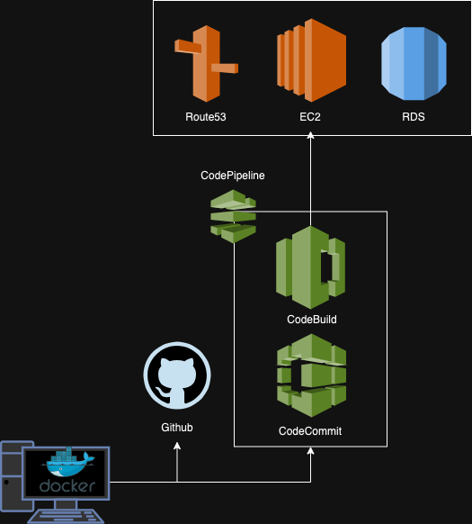
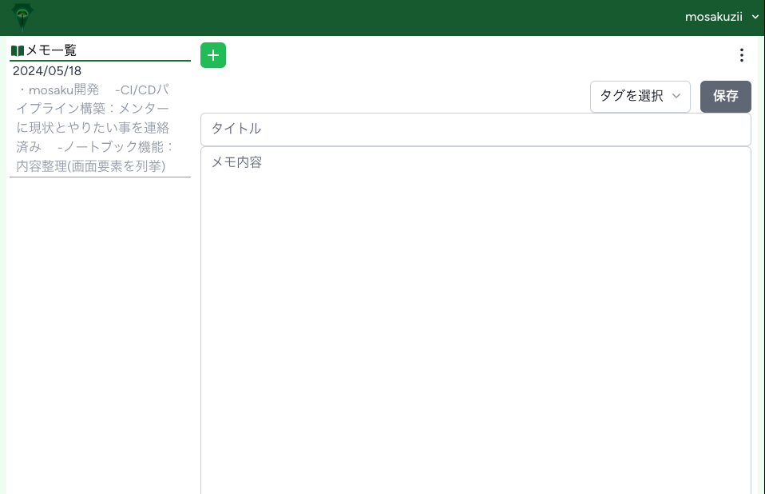

# Mosaku
<a href="https://mosaku.life">https://mosaku.life</a>

## Mosakuとは

Mosakuは、メモアプリです。  
現時点(2024/05/25)では、メモのCRUD(Create,Read,Update,Delete)とメモに付与するタグのCRUDが実装されています。  
気持ち良く言葉を書けるアプリを目指し開発しています。  

## 使用技術

- Laravel 11.2
- React 18.2
- Vite 5.2
- Tailwind CSS
- AWS(デプロイ環境)
    - EC2(Amazon Linux 2023)
    - RDS(MySQL 8.0.35)
    - VPC
    - Route53
    - CodeBuild
    - CodeCommit
- Docker/Docker Compose(ローカル開発環境)

## 構成図

## 機能一覧

- アクセスキー認証機能
- ユーザ登録機能
- ログイン/ログアウト機能
- メモCRUD機能
- タグ付与機能
- タグCRUD機能  
※現在ノートブック機能を実装中

## スクリーンショット

## ユーザ登録方法
以下のメールアドレスにお問い合わせ下さい。
アクセスキーをお送りします。  
mosaku.contact@gmail.com